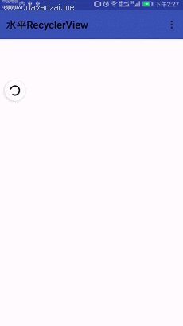
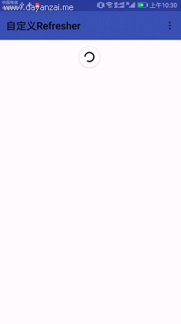

# RefreshRelativelayout
适用于Android平台的拖动刷新控件，支持API 14以上版本的android系统。通过配置orientation属性设置水平方向拖动刷新还是竖直方向下拉刷新或者加载更多等，
另外可以通过实现IRefresher接口实现自定义的刷新header，以适用于实际场景中，并设置了刷新回调接口等。另外还解决了可能存在的滑动冲突的问题，保证嵌套滑动的时候互不影响。
先看实际效果图（效果图较大，工程实际只有300k）。
## Demo
###### 竖直方向嵌套

###### 水平方向嵌套

###### 混合嵌套


[Download Demo](/demoGif/app-debug.apk)
----

Usage
-----
### Gradle
```groovy
dependencies {
   compile 'com.mbg.refreshrelativelayout:library:1.3.0'
}
```
### Maven
```xml
<dependency>
  <groupId>com.mbg.refreshrelativelayout</groupId>
  <artifactId>library</artifactId>
  <version>1.3.0</version>
  <type>pom</type>
</dependency>
```
* xml中配置（RefreshRelativelayout只支持一个子View）
```xml
    <com.mbg.library.RefreshRelativeLayout
            android:layout_width="match_parent"
            android:layout_height="match_parent"
            android:id="@+id/base_refresh">
            <WebView
                android:id="@+id/webview"
                android:layout_width="match_parent"
                android:layout_height="match_parent"/>
    </com.mbg.library.RefreshRelativeLayout>
```
* 自定义属性

|attribute|value type|defalut value| description|
| --- | --- | --- | --- |
|orientation|enum|vertical|布局方式水平或竖直(horizontal/vertical)|
|positiveEnable|boolean|true|下拉刷新或者右滑刷新是否可用|
|negativeEnable|boolean|true|上滑加载更多或左滑加载是否可用|
|positiveDragEnable|boolean|true|positve方向可拖拽或是滑动到边缘自动加载|
|negativeDragEnable|boolean|true|negative方向可拖拽或是滑动到边缘自动加载|
|isPositiveOverlay|boolean|true|positive方向刷新控件显示时是否悬浮在子View上方|
|isNegativeOverlay|boolean|true|negative方向刷新控件显示时是否悬浮在子View上方|
|positive_refresher_type|enum|PROGRESSOR|默认提供的positive刷新控件|
|negative_refresher_type|enum|HORIZONTAL_LOADMORE|默认提供的negative刷新控件|

* Java代码中使用方法
```java
    RefreshRelativeLayout refreshRelativeLayout=(RefreshRelativeLayout)findViewById(R.id.base_refresh);
    //设置自定义positiveRefresher
    refreshRelativeLayout.setPositiveRefresher(new PositiveRefresherWithText(true));
    //设置自定义negativeRefresher
    refreshRelativeLayout.setNegativeRefresher(new NegativeRefresherWithNodata(true));
    //设置positiveRefresher是否可用
    refreshRelativeLayout.setPositiveEnable(true);
    //设置negativeRefresher是否可用
    refreshRelativeLayout.setNegativeEnable(true);
    //设置positiveRefreshView是否悬浮在子View之上
    refreshRelativeLayout.setPositiveOverlayUsed(false);
    //设置negativeRefreshView是否悬浮在子View之上
    refreshRelativeLayout.setNegativeOverlayUsed(true);
    //设置positiveRefreshView可拖拽或自动加载
    refreshRelativeLayout.setPositiveDragEnable(true);
    //设置negativeRefreshView可拖拽或自动加载
    refreshRelativeLayout.setNegativeDragEnable(false);
    //添加刷新事件监听器
    refreshRelativeLayout.addRefreshListener(new IRefreshListener() {
                @Override
                public void onPositiveRefresh() {
                }

                @Override
                public void onNegativeRefresh() {
                }
            });
     //添加positiveRefresher刷新事件监听器
     refreshRelativeLayout.addPositiveRefreshListener(new ISingleRefreshListener() {
                 @Override
                 public void onRefresh() {
                 }
             });
     //添加negativeRefresher刷新事件监听器
     refreshRelativeLayout.addNegativeRefreshListener(new ISingleRefreshListener() {
                 @Override
                 public void onRefresh() {
                 }
             });
     //开始positiveRefresh
     refreshRelativeLayout.startPositiveRefresh();
     //结束positiveRefresh
     refreshRelativeLayout.positiveRefreshComplete();
     //开始negativeRefresh
     refreshRelativeLayout.startNegativeRefresh();
     //结束negativeRefresh
     refreshRelativeLayout.negativeRefreshComplete();
```
* 建议使用方法

在实际使用过程中，属性配置建议使用xml配置的方式，在java代码中每次重新设置属性都会重新布局。

## 自定义刷新refresher
实际生产中需求的效果五花八门，所以refresher应该是可定制的。自定义refrehser也非常简单，只需要实现
IRefresher这个接口即可，如下：
```java
public interface IRefresher {
    //获取RefresherView
    View getView(Context context, ViewGroup viewGroup);
    void onDrag(float offset);
    //当前位移是否达到刷新或加载更多的条件（offset相对为正直）
    boolean canRefresh(float offset);
    //当前refresher在刷新或加载时的位移，默认为0
    float getOverlayOffset();
    //刷新控件已经位于指定位置上开始刷新或者加载，返回值为true表示立即结束，一般多情况下返回false，类似demo中右滑加载更多的情况返回true
    boolean onStartRefresh();
    //当前还在刷新状态，只是需要隐藏refresher时调用，结束当前正在刷新的动画等
    void onStopRefresh();
    //刷新结束，收起refresher，返回值表示收起refresher的延时（比如qq下拉刷新结束的延时）
    long onRefreshComplete();
}
```
IRefresher这个接口是可定制化的，诸如加载更多时没有更多数据也可以在Refresher中实现,下图是我自定义实现的没有更多数据的refresher
###### 没有更多数据



